# Projekat iz Web Programiranja Online Prodavnica
Mladen Antic 17545

Ovaj projekat predstavlja implementaciju internet prodavnice. U prodavnici se nalaze artikli koje je moguce dodavati u korpu. Aplikacija je tako implementirana da samo jedna korpa postoji za jednu prodavnicu. Kada se obavi kupovina, korpa se prazni i svi artikli iz nje se dodaju na racun koji se kreira za svaku kupovinu. Racun moze da sadrzi vise artikala i artikal se moze naci na vise racuna (M:N veza na dijagramu ispod). Dizajn aplikacije je fleksibilan na taj nacin da se deo gde se prikazuju artikli, sadrzaj korpe i racuni prilagodjava unutrasnjem sadrzaju, dok deo za komande zadrzava visinu(slika 2). Na mobilnim telefona se komande crtaju na vrhu a ostatak prikaza aplikacije se iscrtava ispod i siri se od ivice do ivice ekrana(slika 3).

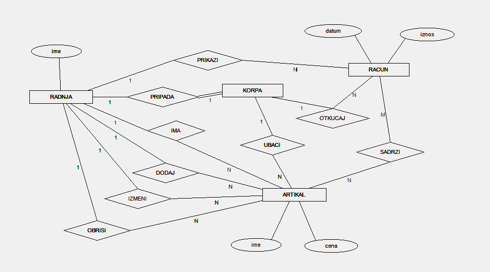

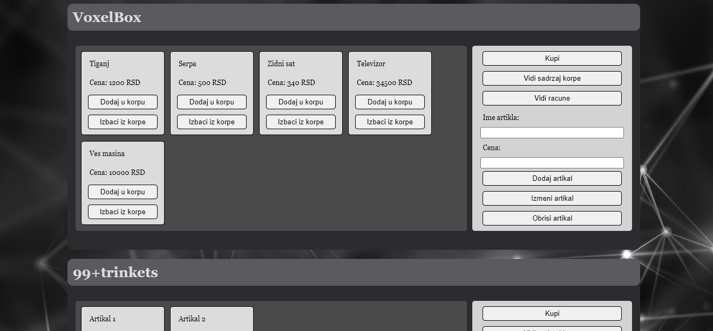

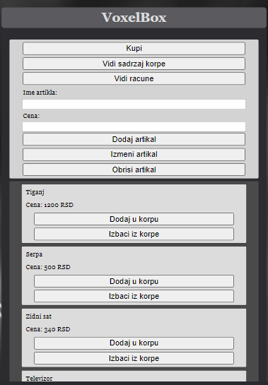

# Funkcije

## CRUD operacije sa artiklom

Artikal je entitet koji ima implementirane sve CRUD operacije. Dodavanje artikla se obavlja unosom podataka u odgovarajuca polja, gde ce aplikacija upozoriti korisnika ako je uneo predugacko ime ili ga nije uneo uopste, kao i ako je cena negativna ili nije unesena u polje.
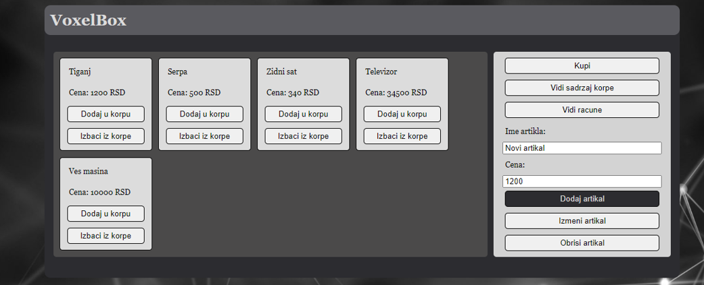
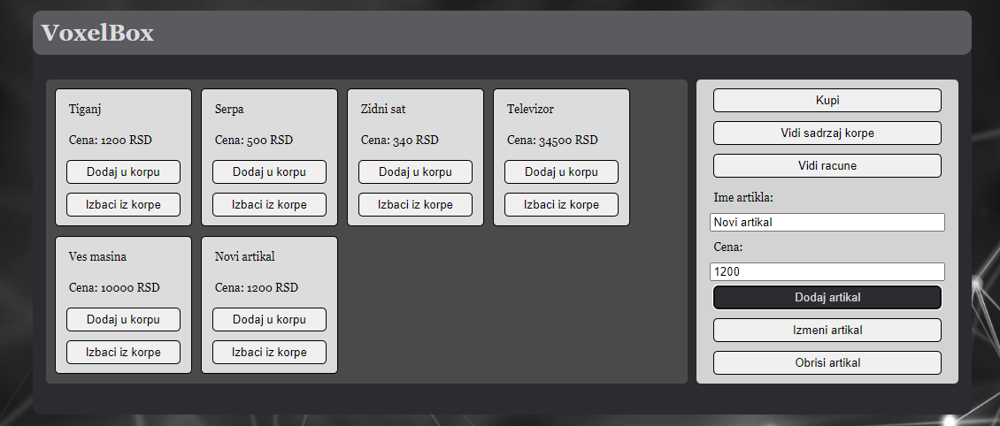
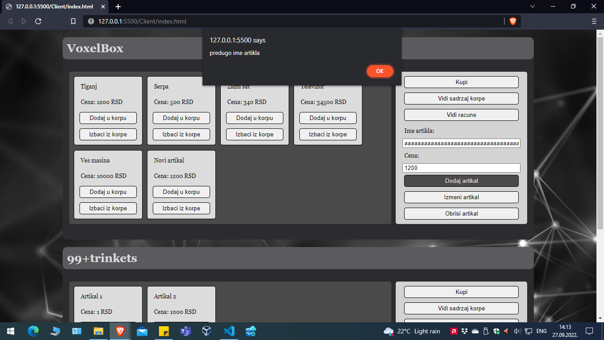
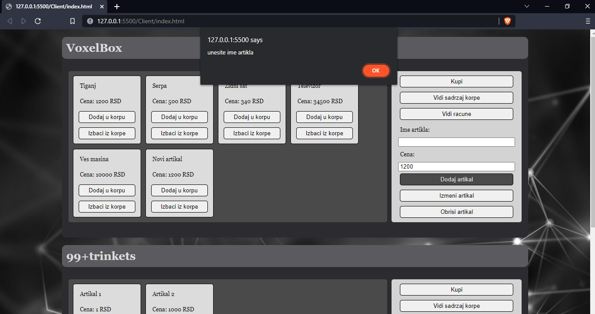
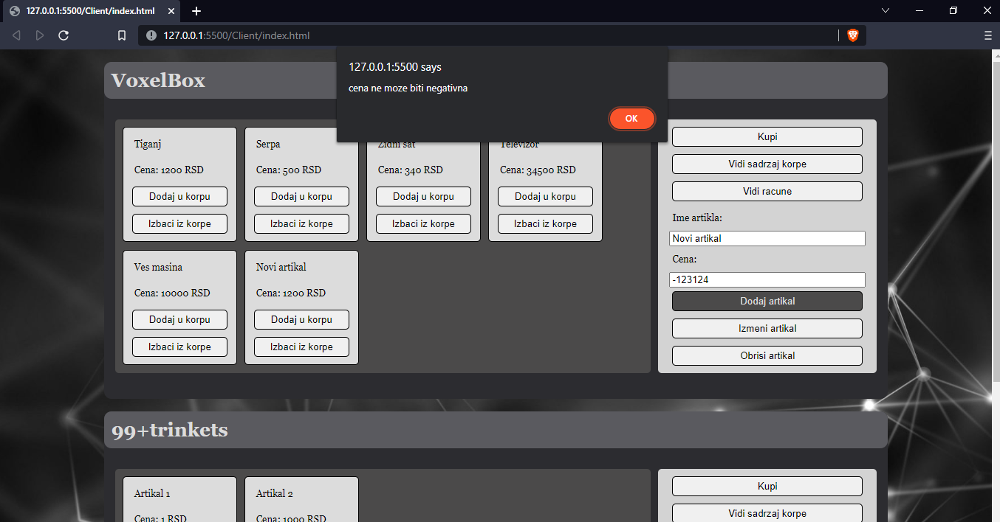
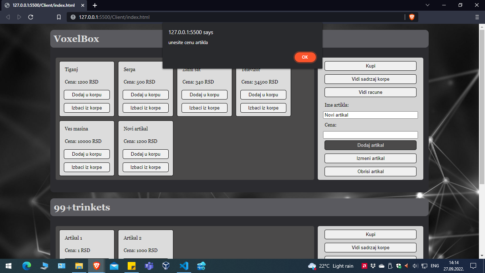
Posto se artikli pretrazuju na osnovu njihovog imena, treba voditi racuna da im je ime jedinstveno. Ako unesemo pogresno ime, mozemo odmah kliknuti na dugme Obrisi kako bi posle uneli artikal sa ispravnim imenom. Artikal se ne moze obrisati nakon sto je kupljen. Ovo je uradjeno zbog toga da bi postojala stroga evidencija kupovine artikala.

Klikom na dugme izmeni mozemo promeniti cenu artikla ukoliko artikal sa takvim imenom postoji u bazi.

## Rad sa korpom i racunima

Artikal se ubacuje u korpu klikom na dugme Dodaj u korpu. Korpa se moze prikazati klikom na dugme Prikazi korpu u okviru komandi aplikacije. Klikom na dugme Nazad vraca se prikaz artikala u radnji. Artikal se izbacuje iz korpe klikom na dugme Izbaci iz korpe.
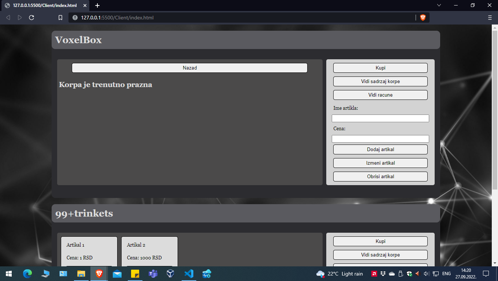
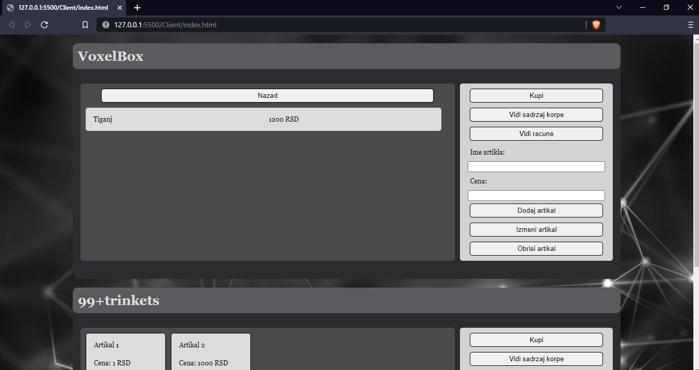
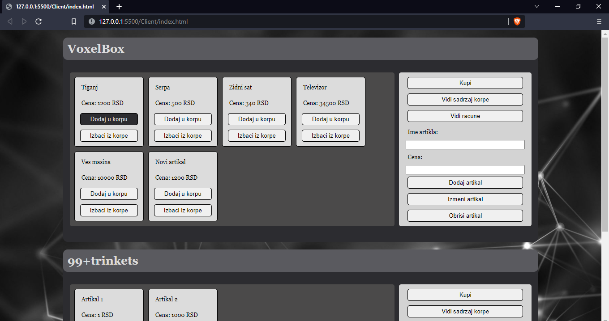
Kada korpa u prodavnici sadrzi bar jedan artikal klikom na dugme Kupi kreira se racun u bazi. Racun sadrzi ukupan iznos koji je placen za sve artikle u trenutku kupovine, datum kupovine, i artikle koji su na konkretnom racunu. Klikom na dugme Detalji prikazuju se artikli na racunu. 
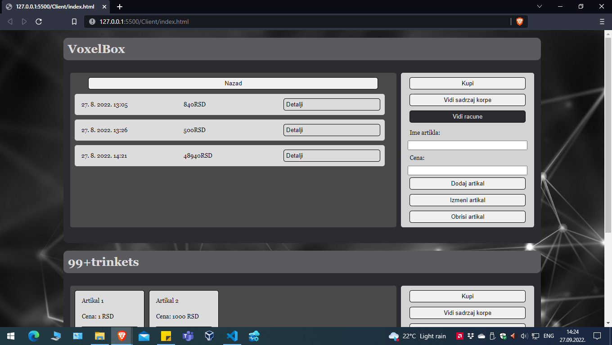
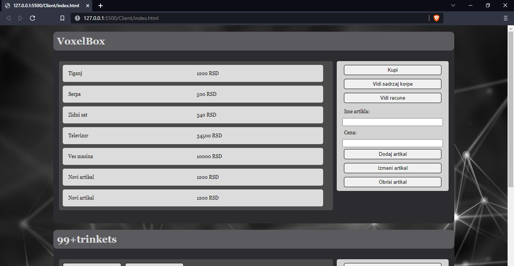
